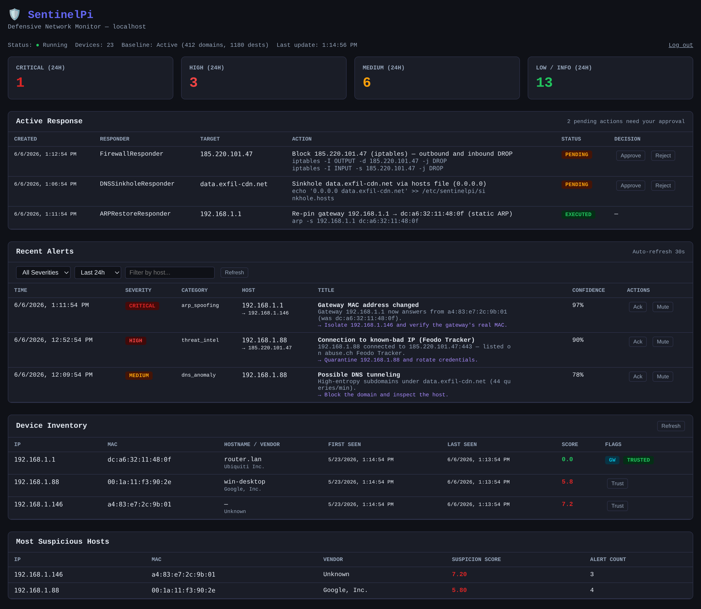
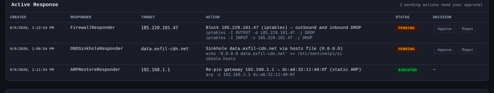
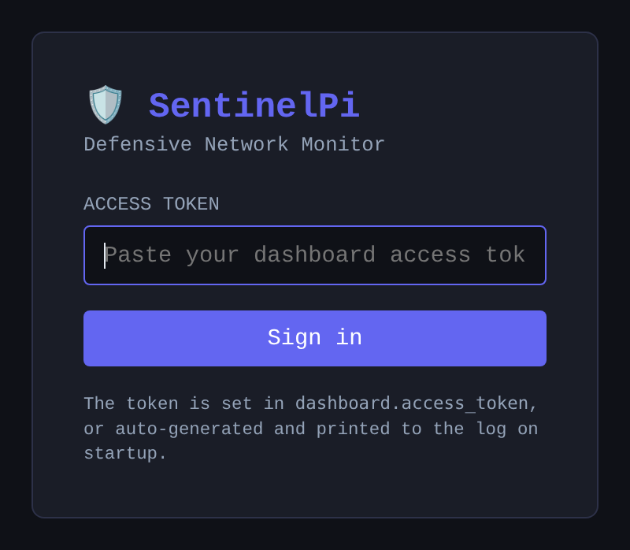

<div align="center">

# 🛡️ SentinelPi

### Lightweight defensive network anomaly monitor for the Raspberry Pi

Passively watch your home lab or small-office LAN, learn what "normal" looks like, and get
clear, human-readable alerts the moment something deviates — rogue devices, ARP spoofing,
port scans, C2 beaconing, DNS abuse, lateral movement, SSH brute force, and more.

[](https://www.python.org/)
[](#requirements)
[](LICENSE)
[](https://github.com/sparktron/sentinelPi-/actions/workflows/ci.yml)
[](#safety-boundaries)

</div>

<div align="center">
  
</div>

---

> **Defensive by design.** SentinelPi is a monitoring and detection tool. It contains **no**
> offensive capabilities — no exploit code, no traffic injection, no credential harvesting, no
> MITM. Its optional active-response layer is opt-in, dry-run by default, and human-approval
> gated. See [Safety boundaries](#safety-boundaries).

## Table of contents

- [Why SentinelPi](#why-sentinelpi)
- [Features](#features)
- [Screenshots](#screenshots)
- [Requirements](#requirements)
- [Installation](#installation)
- [Usage](#usage)
- [Configuration](#configuration)
- [Detection capabilities](#detection-capabilities)
- [Active response (optional)](#active-response-optional)
- [Whole-network coverage](#whole-network-coverage)
- [Architecture](#architecture)
- [Alert severity levels](#alert-severity-levels)
- [Testing](#testing)
- [Documentation](#documentation)
- [Safety boundaries](#safety-boundaries)
- [License](#license)

## Why SentinelPi

Most home and small-office networks are completely unmonitored. SentinelPi turns a spare
Raspberry Pi into an always-on sensor that builds a behavioral baseline over days, then flags
the things that don't fit — without flooding you with noise. Every alert comes with a plain-
English description, a confidence score, and a recommended next step.

- **Runs for months.** Thread-safe, WAL-mode SQLite, bounded memory, clean systemd shutdown.
- **Works without root.** `/proc/net` polling and flow ingestion mean packet capture is optional.
- **Low noise.** Per-detector thresholds, sensitivity profiles, dedup, cooldowns, and quiet hours.
- **Actionable.** Threat-intel enrichment, device fingerprinting, GeoIP/ASN context on every hit.
- **Self-aware.** Watchdog `SYSTEM` alerts warn when SentinelPi itself is degraded.

## Features

**🔍 Detection**
- **Device inventory** — tracks every LAN device by MAC/IP; flags new and rogue hosts
- **ARP spoofing** — gateway MAC changes, conflicting replies, reply floods (MITM signature)
- **Port scans** — vertical scans and subnet sweeps via sliding-window counters
- **C2 beaconing** — regular outbound intervals detected by coefficient-of-variation
- **Connection anomalies** — count spikes, new destinations, new listening ports (z-score)
- **DNS abuse** — DGA domains, DNS tunneling, NXDOMAIN floods, encrypted-DNS (DoH/DoT) bypass
- **Lateral movement** — admin-protocol fan-out between internal hosts
- **Auth-log monitoring** — SSH brute force, new logins, sudo abuse
- **Active-hours & geo** — first connection to a new country, activity outside learned hours

**🧠 Intelligence & enrichment**
- **Threat-intel feeds** — abuse.ch URLhaus / Feodo Tracker, Spamhaus DROP; cached & refreshed daily
- **Passive device fingerprinting** — classifies cameras, phones, IoT, NAS, consoles, routers…
- **GeoIP + ASN reputation** — country and network context attached to external destinations
- **Behavioral baseline** — Welford online statistics; deviations scored, not hard-coded

**🖥️ Interface & alerting**
- **Web dashboard** — local dark-themed Flask UI: SSE live updates, alerts, device inventory,
  per-host drill-down pages, suspicious hosts, and a pending-response approval queue
  (token login, session cookie)
- **Alert management** — dedup, cooldowns, severity levels, acknowledge & mute
- **Structured outputs** — console, rotating JSON log, SQLite, optional email, Twilio SMS,
  webhooks & ntfy push (with Approve/Reject buttons for responder approvals), and SIEM export over
  syslog in ECS or CEF format
- **Daily / weekly reports** — rolled-up summaries of what happened on the network

**🌐 Whole-network coverage**
- **Multi-sensor** — forward sensor alerts to a central collector over **mTLS**; per-sensor views
- **Router / firewall flow ingest** — conntrack, NetFlow/IPFIX, and pf/iptables `filterlog`
- **SPAN / mirror-port mode** — see *all* subnet traffic, not just this host's
- **Incident correlation** — optional INCIDENT alerts for cross-sensor breadth, multi-target sweeps,
  and single-host sequences like new device -> port scan -> lateral movement

**🛡️ Optional active response** (opt-in, dry-run by default, approval-gated)
- Firewall block (iptables/nftables), DNS sinkhole (hosts/Pi-hole/Unbound),
  ARP re-pin on poisoning, and a generic operator kill-switch — see
  [Active response](#active-response-optional).

## Screenshots

<table>
  <tr>
    <td align="center"><b>Full dashboard</b></td>
  </tr>
  <tr>
    <td></td>
  </tr>
  <tr>
    <td align="center"><b>Device inventory &amp; most-suspicious hosts</b></td>
  </tr>
  <tr>
    <td></td>
  </tr>
  <tr>
    <td align="center"><b>Active response — approve / reject pending actions</b></td>
  </tr>
  <tr>
    <td></td>
  </tr>
  <tr>
    <td align="center"><b>Token login</b></td>
  </tr>
  <tr>
    <td align="center"></td>
  </tr>
</table>

## Requirements

- Raspberry Pi 4 or newer (or any Debian-based Linux host)
- Python **3.11+**
- A network interface on the subnet you want to watch
- Root or `CAP_NET_RAW` for packet capture — **optional**; `/proc` polling and flow ingest
  work without elevated privileges

## Installation

### Production install (Raspberry Pi / Debian)

The installer creates a locked-down `sentinelpi` system user, sets up a virtualenv under
`/opt/sentinelpi`, grants `CAP_NET_RAW` to the venv Python (so the daemon never runs as root),
and registers the systemd service.

```bash
git clone https://github.com/sparktron/sentinelPi-.git
cd sentinelPi-

# Install as a systemd service
sudo bash scripts/install.sh

# Configure for your network (interface, subnet, gateway, trusted devices)
sudo nano /etc/sentinelpi/sentinelpi.yaml

# Validate the config, then start
sudo -u sentinelpi /opt/sentinelpi/venv/bin/python -m sentinelpi.main --check-config
sudo systemctl start sentinelpi
sudo systemctl status sentinelpi

# Follow the logs
sudo journalctl -u sentinelpi -f
```

Then open the dashboard at **http://localhost:8888/** (see [Usage](#usage) for the access token).

### Development / testing

```bash
git clone https://github.com/sparktron/sentinelPi-.git
cd sentinelPi-

# Create the virtual environment and install dependencies
bash scripts/setup_venv.sh
source venv/bin/activate

# Run the test suite
python -m pytest tests/ -v

# Run the local CI checks
python -m compileall -q src tests
ruff check src tests

# Validate a config and start monitoring (sudo only if packet capture is enabled)
SENTINELPI_CONFIG=config/sentinelpi.yaml python -m sentinelpi.main --check-config
SENTINELPI_CONFIG=config/sentinelpi.yaml python -m sentinelpi.main --check
SENTINELPI_CONFIG=config/sentinelpi.yaml python -m sentinelpi.main
```

## Usage

```text
sentinelpi [--config PATH] [--check-config] [--check] [--version]

  -c, --config PATH   Path to the YAML config (or set SENTINELPI_CONFIG)
      --check-config  Validate configuration and exit
      --check         Validate config, then actively test configured outputs
      --version       Print version and exit
```

**Running:**

```bash
# From the config path
sentinelpi --config /etc/sentinelpi/sentinelpi.yaml

# Or via the environment variable
SENTINELPI_CONFIG=config/sentinelpi.yaml python -m sentinelpi.main
```

`--check-config` validates operator-facing values such as CIDRs, ports, severity names,
responder backends, and sensitivity profiles. It exits non-zero and prints every issue it
finds instead of starting with a bad config.

`--check` starts with the same static validation, then runs active preflight checks for configured
network notifiers and responders. Email connects/authenticates without sending mail; webhook, ntfy,
SMS, SIEM export, and sensor forwarding send a clearly labelled test alert; responders only call side-effect-free
`plan()` and report what they would do.

**Accessing the dashboard.** Authentication is always on. Set a stable token under
`dashboard.access_token`; if you leave it blank, SentinelPi generates one per run and prints
it to the log on startup:

```
No dashboard access_token configured — generated a random one for this run:
    <token>
```

- **In a browser:** open the dashboard and you'll land on a login page — paste the token and
  sign in. A signed, HttpOnly, `SameSite=Strict` session cookie keeps you logged in.
- **Programmatically** (curl, scripts): send `Authorization: Bearer <token>`.

The token is never accepted via the query string (it would leak into logs, history, and
`Referer`). The dashboard binds to `127.0.0.1:8888` by default — keep it on loopback and reach
it over an SSH tunnel rather than exposing it to the LAN:

```bash
ssh -L 8888:127.0.0.1:8888 pi@your-pi
# then browse to http://localhost:8888/
```

Click any host IP in the dashboard to open its drill-down page with device identity, recent alerts,
known destinations, DNS history, learned profile values, and response actions tied to that host.

## Configuration

All behavior is driven by a single YAML file (`config/sentinelpi.yaml`). Every setting ships
with a safe default — you only configure what differs for your network.

| Section | What it controls |
|---------|------------------|
| `network` | Interfaces, subnets, gateway IP/MAC, SPAN/mirror mode |
| `trusted_devices` | Your known devices (suppresses new-device alerts) |
| `monitoring.sensitivity_profile` | `conservative`, `balanced`, or `aggressive` |
| `monitoring.packet_capture_enabled` | `true` for full capture, `false` for `/proc`-only (no root) |
| `monitoring.self_monitoring_*` | Watchdog checks for worker death, stale capture, threat-intel refresh, queue saturation, and low disk |
| `dashboard` | Host/port and access token |
| `notifications` | Email, Twilio SMS, webhook, ntfy, SIEM export (syslog ECS/CEF), and daily/weekly report settings |
| `threat_intel` | Enable blocklist feeds and matching |
| `response` | Optional active-response layer (off + dry-run by default) |
| `multi_sensor` | Collector/sensor mTLS forwarding |
| `flow_ingest` | conntrack / NetFlow / IPFIX / filterlog ingestion |
| `thresholds` / `whitelist_*` | Per-detector tuning and never-alert allowlists |

Quick start: set `network.interfaces`, `network.subnets`, and `network.gateway_ip`, list your
`trusted_devices`, then run `sentinelpi --check-config` and `sentinelpi --check`. Full reference in
[docs/configuration_guide.md](docs/configuration_guide.md).

## Detection capabilities

| Detector | What it finds | Method |
|----------|---------------|--------|
| ARP | Gateway MAC changes, ARP conflicts, reply floods | Rule-based |
| Port scan | Vertical scans, subnet sweeps | Sliding-window counters |
| Beacon | Regular outbound intervals (malware C2) | Coefficient of variation |
| Connection | Count spikes, new destinations, new listening ports | Baseline z-score |
| DNS | DGA domains, tunneling, NXDOMAIN floods | Entropy + rate analysis |
| DoH / DoT | Clients bypassing local DNS via encrypted resolvers | Port + resolver match |
| Lateral movement | Admin-protocol fan-out, new internal connections | Rule + baseline |
| Auth log | SSH brute force, new logins, sudo abuse | Pattern matching |
| Threat intel | Connections to known-bad IPs/domains | Blocklist match |
| GeoIP / ASN | First connection to a new country; bad-reputation networks | Per-host baseline |
| Active hours | Activity outside a host's learned schedule | Time-window baseline |
| Host profile | First use of an unfamiliar destination port or internal peer for that host | Per-host behaviour baseline |

## Active response (optional)

SentinelPi can optionally *act* on the worst alerts — but it is built so it never surprises
you. Responders only ever **describe** an action; a single `ResponderManager` decides whether
it runs, through a layered safety ladder:

```
master off  (response.enabled: false)   →  nothing is planned          ← default
dry-run     (dry_run: true)              →  decide + log, never execute  ← default when enabled
armed       (require_approval: true)     →  hold as PENDING for one-click human approval
trusted     (auto_execute_categories)    →  fire automatically for explicitly listed categories
```

Available responders (all off by default, each with its own guardrails):

| Responder | Action | Guardrails |
|-----------|--------|------------|
| Firewall | DROP a known-bad external IP (iptables/nftables) | Never blocks private/loopback/whitelisted IPs |
| DNS sinkhole | Block a malicious domain (hosts / Pi-hole / Unbound) | Never sinkholes a whitelisted domain |
| ARP restore | Re-pin the configured gateway MAC on poisoning | Requires `gateway_ip` **and** `gateway_mac` |
| Kill switch | Run an operator-supplied command on compromise | No command + no categories = never fires |

The honest default is to watch decisions in dry-run for days, then arm with a human in the
loop before trusting any category to fire on its own. When armed, pending actions surface in
the dashboard's **Active Response** queue, where you approve or reject each one with a click.

## Whole-network coverage

Go beyond a single host:

- **Multi-sensor.** Run SentinelPi on several segments and forward alerts to a central
  collector over **mutual-TLS**. The dashboard offers per-sensor views.
- **Router / firewall flow ingest.** Feed `conntrack`, **NetFlow/IPFIX**, and pf/iptables
  `filterlog` exports so SentinelPi sees flows it could never sniff directly.
- **SPAN / mirror-port mode.** Plug the Pi into a switch mirror port and set
  `network.mirror_mode: true` to analyze *all* subnet traffic in promiscuous mode.

## Architecture

```
                    ┌─────────────────────┐
                    │   Packet Capture    │ (scapy, optional)
                    │   /proc Readers     │ (no root needed)
                    │   Flow Ingest       │ (conntrack/NetFlow/filterlog)
                    │   Auth Log Tailer   │
                    └─────────┬───────────┘
                              │ events
                    ┌─────────▼───────────┐
                    │      Detectors      │  ARP · Port Scan · Beacon
                    │  + Baseline Engine  │  Connection · DNS · DoH
                    │  + Threat Intel     │  Lateral · Auth · Geo/ASN
                    └─────────┬───────────┘
                              │ alerts
              ┌───────────────▼────────────────┐
              │         Alert Manager          │
              │   dedup · cooldown · routing   │
              └──┬───────┬───────┬───────┬─────┘
                 │       │       │       │
          ┌──────▼─┐ ┌───▼──┐ ┌──▼───┐ ┌─▼──────────┐
          │Console │ │SQLite│ │Email │ │ Responder  │
          │ JSON   │ │  DB  │ │ Hook │ │  Manager   │ (gated)
          └────────┘ └──┬───┘ └──────┘ └────────────┘
                        │
                  ┌─────▼──────┐
                  │  Flask UI  │  ← + collector (mTLS) for multi-sensor
                  │ Dashboard  │
                  └────────────┘
```

| Module | Purpose |
|--------|---------|
| `capture/` | Packet sniffing (scapy), `/proc/net` polling, flow ingest, honeypot |
| `detectors/` | Rule-based and baseline-deviation anomaly detectors |
| `inventory/` | Device tracking, classification, DHCP-lease correlation |
| `baseline/` | Welford online statistics, behavioral baseline |
| `intel/` | Threat-feed download, caching, and matching |
| `alerts/` | Dedup, cooldown, correlation, notification routing |
| `responders/` | Optional, gated active-response actions |
| `storage/` | SQLite persistence (WAL mode, thread-safe, migrations) |
| `ui/` | Flask web dashboard + multi-sensor collector |
| `config/` | YAML loading and validation |
| `utils/` | Network helpers, GeoIP/ASN, timezone-aware clock |

## Alert severity levels

| Level | Meaning | Example |
|-------|---------|---------|
| `info` | Informational, no action needed | Client using encrypted DNS |
| `low` | Minor anomaly, worth noting | New device from a known vendor |
| `medium` | Suspicious, investigate when convenient | New SSH login from an unseen IP |
| `high` | Likely malicious, investigate promptly | Port scan; connection to known-bad IP |
| `critical` | Active threat indicator, act now | Gateway MAC changed (ARP poisoning) |

## Testing

```bash
source venv/bin/activate
python -m pytest tests/ -v
python -m compileall -q src tests
ruff check src tests

# With coverage
python -m pytest tests/ --cov=sentinelpi --cov-report=term-missing
```

Fixtures simulate real attack traffic so detectors are tested end-to-end:

- Normal home-network traffic (baseline)
- Port scan (100+ ports in 30s)
- Beaconing malware (regular 60s intervals)
- ARP spoofing (gateway MAC change)
- SSH brute force (50 failures in 100s)
- DNS tunneling (long encoded subdomains) and DGA NXDOMAIN floods

## Documentation

- [Threat Model & Scope](docs/threat_model.md)
- [Configuration Guide](docs/configuration_guide.md)
- [systemd Setup Guide](docs/systemd_setup.md)
- [Troubleshooting](docs/troubleshooting.md)
- [Security Considerations](docs/security_considerations.md)
- [Feature Roadmap](docs/FEATURE_ROADMAP.md)
- [Development Roadmap](docs/DEVELOPMENT_ROADMAP.md)

## Safety boundaries

SentinelPi is a **defensive monitoring tool**. It does **not**:

- Inject, modify, or forge network traffic
- Perform active exploitation or vulnerability scanning
- Harvest credentials or intercept encrypted traffic
- Execute man-in-the-middle attacks
- Provide remote shell access or persistence mechanisms
- Include any offensive security capability

The optional [active-response](#active-response-optional) layer is **off and in dry-run by
default**, refuses to touch private/loopback/whitelisted targets, and holds risky actions for
explicit human approval. It exists to *contain* a confirmed threat (block a C2 IP, sinkhole a
malicious domain, re-pin your real gateway MAC) — never to attack.

## License

[MIT](LICENSE) © SentinelPi Project
